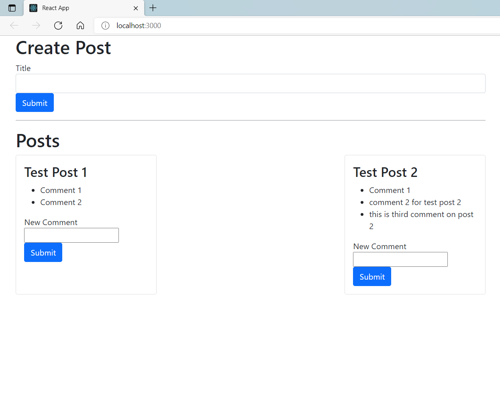

# Blog

This repository conatins 3 directory

    client
    comment
    post
to run this project install the dependencies and run the view following the steps

## Post

this directory conatains the microservices of post

    npm i 
    npm start
post api will run using port 4000

## Comment

this directory conatains the microservices of comment

    npm i 
    npm start
comment api will run using port 4001

## Client

client conatins the view developed in react

    npm i
    npm start

### Happy coding

## Screenshots

